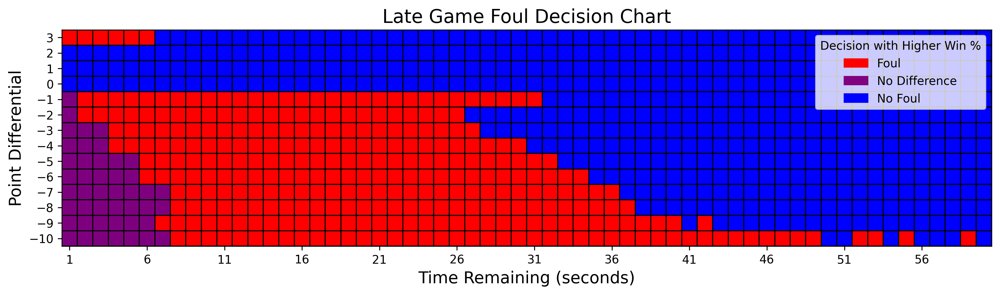

This project is to see when NBA teams should foul late in the game.   
overall_sim is the main file that runs everything. 

I go into much more detail at: https://www.ryderfried.com/projects

Length of a possession is modeled witha Normal Distribution. I decided to do this based on the the "Normal_QQ_PLOT_3.png" and "time_hist.png" in the plots folder. Points per possession are modeled with a categorical distribution, when was generated using basketball reference statistics combined with a recursive simulaiton to account for offensive rebounds.

To actually determine when it was better to foul, I used recrusive game sequences to make my simulation more efficient.

Here is a graphic with my results. One note: for the game simulations to end, I set the minimum possession length to 0.51 seconds.

